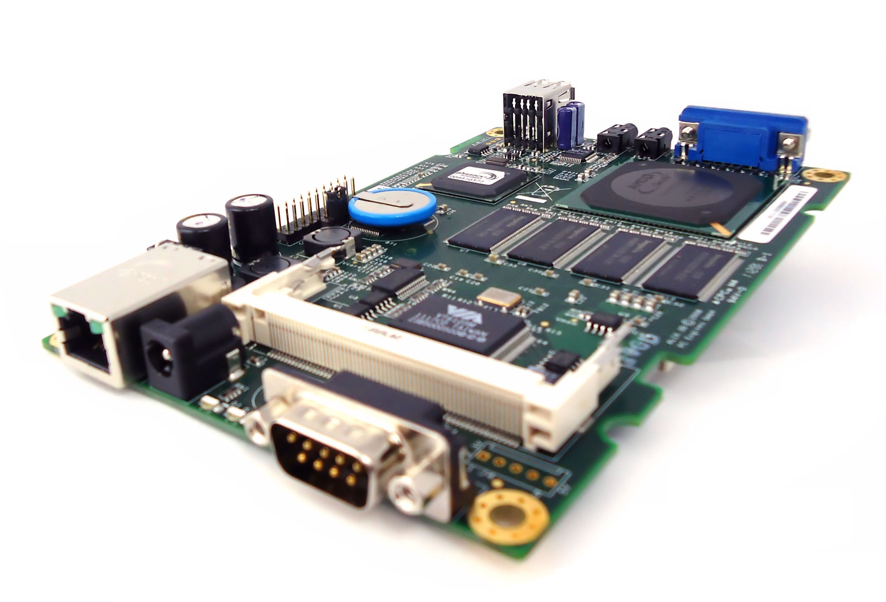
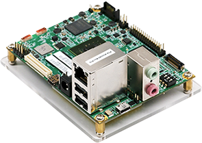
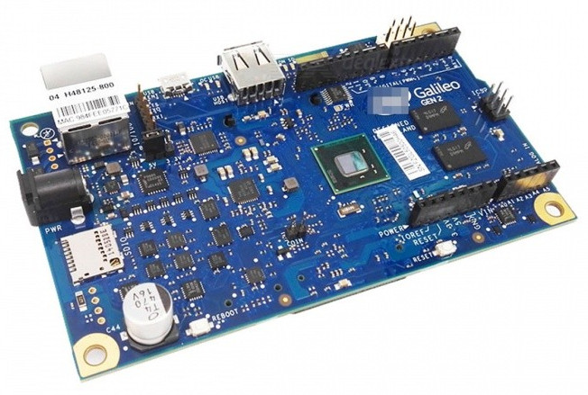
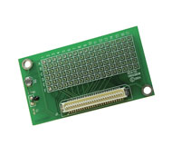
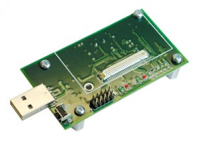
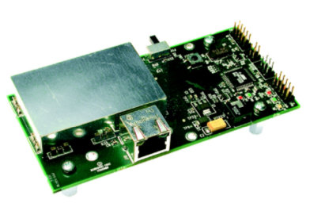
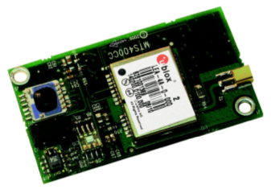
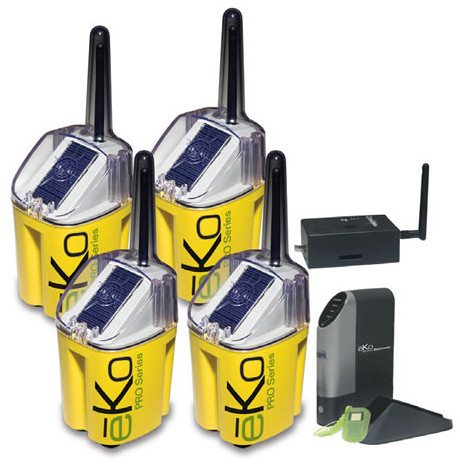

## Hardware Equipment

#### On-board Computers

<table>
<tr>
<td><figure align="center"><a href="http://www.pcengines.ch/pdf/alix3d3.pdf" target="_blank"><figcaption >Alix-3d3</figcaption></a></figure></td>
<td><figure align="center"><a href="http://docs-europe.electrocomponents.com/webdocs/14ba/0900766b814ba5fd.pdf" target="_blank"><figcaption >Raspberry Pi</figcaption></a></figure></td>
<td><figure align="center"><a href="https://www.inforcecomputing.com/public_docs/Inforce%20DataSheet_6410_03-2015.pdf" target="_blank"><figcaption >Inforce IFC6410</figcaption></a></figure></td>
<td><figure align="center"><a href="https://www.intel.com/content/dam/www/public/us/en/documents/datasheets/galileo-g2-datasheet.pdf" target="_blank"><figcaption >Intel Galileo GEN 2</figcaption></a></figure></td>
</tr>
</table>

#### Sensor Networks

<table>
<tr>
<td><figure align="center"><a href="http://www.memsic.com/userfiles/files/Datasheets/WSN/IRIS_Datasheet.pdf" target="_blank"><figcaption >IRIS Mote</figcaption></a></figure></td>
<td><figure align="center"><a href="http://www.memsic.com/userfiles/files/Datasheets/WSN/micaz_datasheet-t.pdf" target="_blank"><figcaption >Crossbow Micaz Mote</figcaption></a></figure></td>
<td><figure align="center"><a href="https://www.memsic.com/userfiles/files/Datasheets/WSN/mts_mda_datasheet.pdf" target="_blank"><figcaption >MDA100 Data Acquisition Board</figcaption></a></figure></td>
<td><figure align="center"><a href="http://data.datasheetlib.com/pdf1/143/91/1439174/memsic-mib520_e4febd59fa.pdf?take=binary" target="_blank"><figcaption >MIB520 Interface/Programming Board</figcaption></a></figure></td>
</tr>

<tr>
<td><figure align="center"><a href="http://www.memsic.cn/userfiles/files/Datasheets/WSN/6020-0055-05_a_mib600-t.pdf" target="_blank"><figcaption>MIB600 Base Station / Gateway Board</figcaption></a></figure></td>
<td><figure align="center"><a href="http://www.memsic.cn/userfiles/files/Datasheets/WSN/mts400_420_datasheet-t.pdf" target="_blank"><figcaption>MTS420CC Sensor Board</figcaption></a></figure></td>
<td><figure align="center"><a href="http://datasheet.datasheetarchive.com/originals/distributors/Datasheets-8/DSA-142718.pdf" target="_blank"><figcaption>MIB510 Base Station</figcaption></a></figure></td>
<td><figure align="center"><a href="https://cdn.sparkfun.com/datasheets/Sensors/Proximity/HCSR04.pdf" target="_blank"><figcaption >HC-SR04 Ultrasonic Ranging Module</figcaption></a></figure></td>
</tr>

<tr>
<td><figure align="center"><a href="http://www.memsic.com/userfiles/files/Datasheets/WSN/eko_starter_system.pdf" target="_blank"><figcaption>eKo Pro - Environmental Monitoring System</figcaption></a></figure></td>
</tr>

</table>

#### Microcontroller
<table>
<tr>
<td><figure align="center"><a href="https://store.arduino.cc/usa/arduino-uno-rev3" target="_blank"><figcaption>Arduino-UNO</figcaption></a></figure></td>
</tr>
</table>

## Software Tools

+ **Operating Systems**
	- [Ubuntu 14.04 LTS](http://releases.ubuntu.com/14.04/), [Ubuntu 16.04 LTS](http://releases.ubuntu.com/16.04/), and [Ubuntu 18.04 LTS](http://releases.ubuntu.com/18.04/) for Desktops and Laptops
	- [Raspbian Jessie](https://www.raspberrypi.org/downloads/raspbian/) for Raspberry Pi boards
	- [Voyage Linux 0.9.2](http://mirror.voyage.hk/download/ISO/voyage-0.9.2.iso) for Alix.3d3 boards
	- [Linaro Snapdragon 600 Linux](https://wiki.linaro.org/Boards/IFC6410) for IFC 6410 boards
	- [TinyOS](https://github.com/tinyos/) for sensor motes
	- [Ryu SDN Framework](https://osrg.github.io/ryu/) for SDN network operating system
	
+ **Simulators**
	- <a href="https://www.isi.edu/nsnam/ns/" target="_blank">ns-2</a>, <a href="https://www.nsnam.org/" target="_blank">ns-3</a>
	- <a href="https://www.netlab.tkk.fi/tutkimus/dtn/theone/" target="_blank">Opportunistic Network Environment (ONE)</a> for DTNs
	- <a href="https://github.com/iist-sysnet/UDTNSim" target="_blank">Urban DTN Simulator (UDTNSim)</a> for DTNs
	- [NetSim](https://www.tetcos.com/netsim-pro.html)
	- [OMNeT++](https://omnetpp.org/)
	
+ **Software Tools**
	- <a href="http://openvswitch.org/" target="_blank">Open vSwitch</a> for OpenFlow switches for SDN
	- <a href="https://www.wireshark.org/" target="_blank">Wireshark</a>, <a href="http://www.tcpdump.org/" target="_blank">tcpdump</a>, and <a href="https://github.com/KimiNewt/pyshark" target="_blank">pyshark</a> for network analysis
	
+ **Computational Tools**
	- <a href="https://www.mathworks.com/products/matlab.html" target="_blank">MATLAB</a>
	- <a href="https://networkx.github.io/" target="_blank">NetworkX</a>, <a href="http://igraph.org/python/" target="_blank">igraph</a> (For complex 	network analysis)
	- <a href="http://www.numpy.org/" target="_blank">Numpy</a>
	
+ **Programming Languages**
	- C
	- <a href="https://www.python.org/" target="_blank">Python</a>
	- <a href="http://nescc.sourceforge.net/" target="_blank">nesC</a> (For sensor programming)
	- Bash Shell Scripting
	

