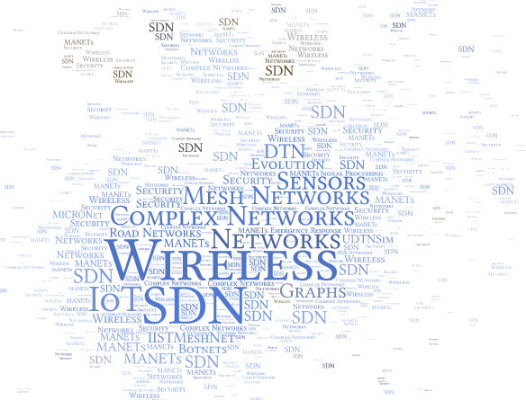

<!-- Image Map Generated by http://www.image-map.net/ -->
<a href="research.html">

<map name="image-map">
    <area target="_blank" alt="B. S. Manoj" title="B. S. Manoj" href="https://www.iist.ac.in/avionics/bsmanoj" coords="191,161,302,181" shape="rect">
    <area target="_blank" alt="Abhishek Chakraborty" title="Abhishek Chakraborty" href="https://chakrabortyabhishek.github.io/" coords="236,237,329,252" shape="rect">
    <area target="_blank" alt="Sarath Babu" title="Sarath Babu" href="https://4sarathbabu.github.io/" coords="204,86,267,101" shape="rect">
    <area target="_blank" alt="Vineeth B. S." title="Vineeth B. S." href="https://vineethbs.github.io/" coords="205,212,266,223" shape="rect">
    <area target="_blank" alt="Software Defined Networks" title="Software Defined Networks" href="https://www.opennetworking.org/sdn-definition/" coords="224,189,258,203" shape="rect">
    <area target="_blank" alt="Delay Tolerant Networks" title="Delay Tolerant Networks" href="https://en.wikipedia.org/wiki/Delay-tolerant_networking" coords="211,295,256,311" shape="rect">
    <area target="_blank" alt="Internet of Things" title="Internet of Things" href="https://en.wikipedia.org/wiki/Internet_of_things" coords="167,72,190,85" shape="rect">
    <area target="_blank" alt="Rahul Singh" title="Rahul Singh" href="https://rahulsinghchandraul.github.io/" coords="238,125,293,138" shape="rect">
    <area target="_blank" alt="Small World Networks" title="Small World Networks" href="https://en.wikipedia.org/wiki/Small-world_network" coords="230,152,304,159" shape="rect">
    <area target="" alt="Research Areas" title="Research Areas" href="research.html" coords="201,389,107,372,30,303,4,216,18,122,72,50,132,22,192,10,266,22,327,51,365,105,391,168,390,238,367,296,321,345,268,374" shape="poly">
</map>
