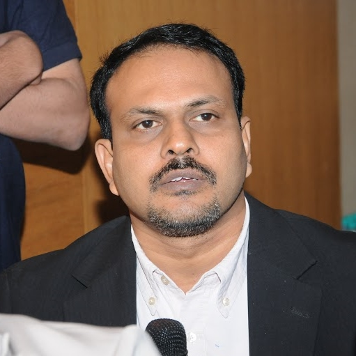
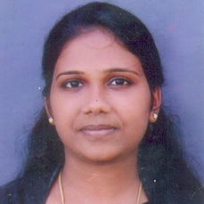
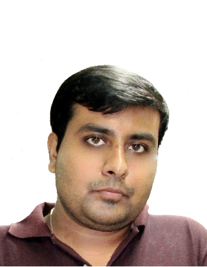
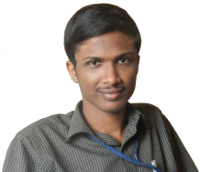
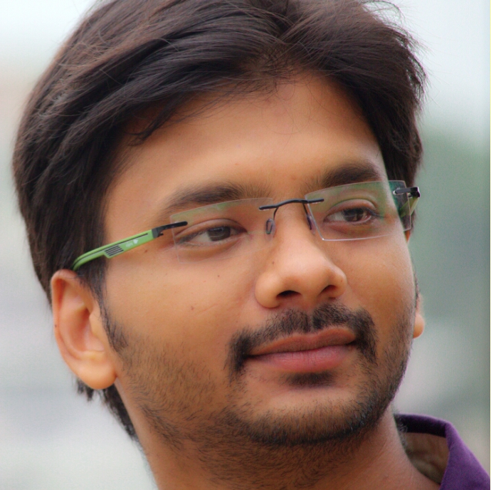
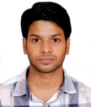

### Faculty
 

<a href="https://www.iist.ac.in/avionics/bsmanoj" target="_blank">
  
B. S. Manoj, PhD</a>  
Professor & Head  
Department of Avionics, IIST 

#### Post-Doctoral Fellow

<table>
<tr>
<td><figure align="center"><a><figcaption>Prescilla Koshy, PhD</figcaption></a></figure> </td>
</tr>
</table>

#### Ph.D. Students

<table>
<tr>
<td><figure align="center"><a href="https://chakrabortyabhishek.github.io/" target="_blank"><figcaption>Abhishek Chakraborty</figcaption></a>(Completed)</figure> </td>
<td><figure align="center"><a href="https://4sarathbabu.github.io/" target="_blank"><figcaption>Sarath Babu</figcaption></a>(Ongoing)</figure></td>
<td><figure align="center"><figcaption>Chalumuri Avinash</figcaption>(Ongoing)</figure></td>
<td><figure align="center"><a href="https://www.linkedin.com/in/debabrata-dalai-a88b6486"><figcaption>Debabrata Dalai</figcaption></a>(Ongoing)</figure></td>
</tr>
</table>

#### Undergraduate Students
1. Ansuman Palo
1. Karumuru Venkata Niranjan Sai
1. Pratabidya Panda
1. Reuben Chacko Thomas
1. S Sai Avinash
1. Suraj R

#### Lab Staff
1. Divya R. S.

------

<h2>Alumni</h2>

#### Post-Doctoral Fellow

1. [Dharmendra Singh Yadav, PhD (2016)](https://scholar.google.co.in/citations?user=yGWRD0YAAAAJ&hl=en){:target="_blank"}

#### Masters Students

1. [Rahul Singh (2015)](https://rahulsinghchandraul.github.io/){:target="_blank"}

#### Project Fellow

1. Sheena S. Rajan (2015)

#### Undergraduate Students 

+ **2017 -- 2018**
  1. Alsaj A. S.
  2. T. Abhiroop
  3. V. Mohanasruthi 
  4. Gautham Suresh
  5. Kolli Aravind
  6. Sunkara Jaya Chand

+ **2016 -- 2017**
  1. Anand Narayanan
  2. Ishika Ghara
  3. Keshav Dayal
  4. Mithun P. V.
  5. Priyanka Rathod 
  4. Yuvaraj Sinh Surendrakumar
  5. Y. Naga Rahul

+ **2015 -- 2016**
  1. Ajay Salas
  2. Amal Krishna
  3. Anuj Sarode Ghanshyambhai
  4. Bharath Devasani
  5. Devi Reddy Pramod Reddy
  6. Palash Joshi
  7. Prakhar Gupta  
  8. Saurav Maji
  9. Devireddy Pramod Reddy
  
  
+ **2014 -- 2015**
  1. Abhishek Bhaumick
  2. Anugolu Purnesh Sai Ram
  3. Deepak Kumar Khatri
  4. Gulshan Gupta
  5. M. Aditya Vamsi
  6. Malreddy Yashwant Reddy   
  7. Priti Singh
  8. Somarouth Sai Srinivas
  9. Vinay Gajmoti 
  10. Yogesh Parth  
  11. Pamidiparthi Ravi Teja Naidu
  12. Sourajit Debnath
 
  
+ **2013 -- 2014**
  1. Arun K. P.
  2. Gaurav Jain 
  3. Ishita Ganjoo  
  4. Nivedita Gaur  
  5. Rohit Tyagi 
  6. Tuhin Paul
  
+ **2012 -- 2013**
  1. Aritra Sarkar
  2. Muna Kumar Singh
  3. Shyam Vinay 
  4. Siddharth Srivastava 
  5. Sukirna Roy   
   
+ **2011 -- 2012**
  1. Ajith Kanale
  2. Anusha Singamaneni
  3. Karan Lal
  4. Prashanth Ranjan 
  5. Rajnish Kumar Yadav 
  6. Saket Chawla 
  7. Siddharth Jha

#### Summer Internship Alumni (non-IIST)
+ **2018**
  1. Aditya Halder, NIT Durgapur
  2. Akshay M, TKM Kollam
  3. Archa Gopan, TKM Kollam (M.Tech)
  4. Arnab Haldar, Kalyani Government Engineering College, West Bengal
  5. Ayushi Pandey, KIIT Bhubaneswar
  6. Ganesha Vedarajan Sivagurunathan, NIT Tiruchirappalli
  7. Minu Thomas, Government Engineering College, Barton Hill
  8. Sai Naveen Devarapalli, NIT Tiruchirappalli
  9. Sruthi S, TKM Kollam (M.Tech)
  
+ **2017**
  1. Alfia M, TKM Kollam (M.Tech)
  2. Arya Ajay, TKM Kollam (M.Tech)
  3. Indukathya, JNTUA
  4. Malu Mohan, TKM Kollam (M.Tech)
  5. Manisha Pedhaguntlpalli, JNTUA
  6. Sandeepan Dash, NIT Tiruchirappalli
+ **2015**
  1. Nikhil M. S., NIT Tiruchirappalli
  2. Nisha Agrawal, IIT Jodhpur
+ **2014**
  1. Sindhuja Kasam, NIT Warangal
+ **2013**
  1. Jain Zachariah, NIT Suratkal
